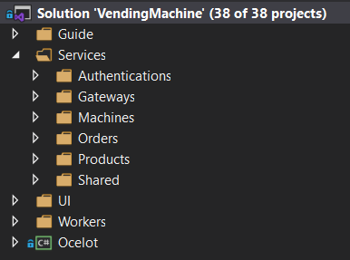
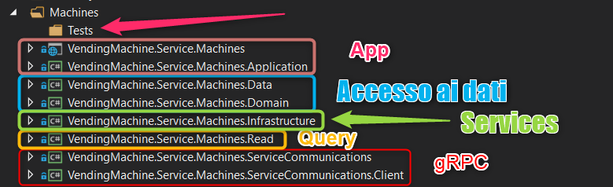

# Struttura del progetto

# Struttura dei progetti

#Utenti
| Username | Password |
|----------|----------|
| test@cloudgen.it | Pass123$ |
| andrea.tosato@4ward.it | Pass123$ |

#Apps

| API | Ports |
|----------|----------|
| Authorize.API | 44330 |
| Machine.API | 4010 |
| Machine.gRPC | 4010 |
| Product.API | 4020 |
| Product.gRPC | 4020 |
| Order.API | 4030 |
| Aggregator.API | 4040 | 
| Gateway.API | 4444 | 
| Blazor | 44385 | 
| Worker | Console App (Windows Service o SystemD) | 