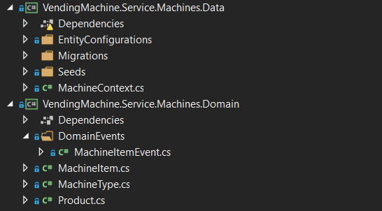

# Entity Framework
La grande novità di EF è la possibilità di essere utilizzata con il pattern DDD.
Questo implica che non abbiamo più necessità estrema di classi che mappano le tabelle o colonne del DB.



### Partiamo ora dal codice

```cs
public class MachineContext : DbContext
{
    private readonly IMediator _mediator;
    public DbSet<MachineItem> Machines { get; set; }
    public DbSet<MachineType> MachineTypes { get; set; }
    public DbSet<Product> ActiveProduct { get; set; }
    public DbSet<ProductConsumed> HistoryProduct { get; set; }

    public MachineContext()
    {
    }

    // Only for application
    public MachineContext(DbContextOptions<MachineContext> options, IMediator _mediator)
        : base(options)
    {
        this._mediator = _mediator;
    }

    protected override void OnModelCreating(ModelBuilder modelBuilder)
    {
        modelBuilder.ApplyConfiguration(new MachineEntityConfiguration());
        modelBuilder.ApplyConfiguration(new MachineVersionEntityConfiguration());
        modelBuilder.ApplyConfiguration(new ActiveProductEntityConfiguration());
        modelBuilder.ApplyConfiguration(new HistoryProductEntityConfiguration());
    }
    
    public override async Task<int> SaveChangesAsync(CancellationToken cancellationToken = default)
        {
            int result = await base.SaveChangesAsync(cancellationToken);
            await _mediator?.DispatchDomainEventsAsync(this);
            return result;
        }
    }
}
```

Per eseguire le migrazioni?

```cs
public class MachineContextFactory : IDesignTimeDbContextFactory<MachineContext>
{
    public MachineContext CreateDbContext(string[] args)
    {
        var optionsBuilder = new DbContextOptionsBuilder<MachineContext>();
        optionsBuilder.UseSqlServer(
            "Server=(localdb)\\mssqllocaldb;Database=VendingMachine-Machines;Trusted_Connection=True;MultipleActiveResultSets=true",
            x => x.UseNetTopologySuite());
        optionsBuilder.EnableSensitiveDataLogging();

        return new MachineContext(optionsBuilder.Options, null);
    }
}
```

## Nota - Entity Framework Migration
**Multitarget projects**:  
```<TargetFrameworks>netcoreapp3.1;netstandard2.1</TargetFrameworks>```
### Prerequisiti
- **Install: Microsoft.EntityFrameworkCore.Design**
#### Per eseguire una migrazione
- **dotnet ef migrations add FirstMigrationMachines --project "VendingMachine.Service.Machines.Data"**
#### Per applicare una migrazione
- **dotnet ef database update --project "VendingMachine.Service.Machines.Data"**
### Per rimuovere le migrazioni:
- **dotnet ef migrations remove --project "VendingMachine.Service.Machines.Data"**


# EF Migration Seed Limitation
- https://docs.microsoft.com/en-us/ef/core/modeling/data-seeding#limitations-of-model-seed-data
This type of seed data is managed by migrations and the script to update the data that's already in the database needs to be generated without connecting to the database. This imposes some restrictions:

The primary key value needs to be specified even if it's usually generated by the database. It will be used to detect data changes between migrations.
Previously seeded data will be removed if the primary key is changed in any way.


# EntityConfigurations

ActiveProductEntityConfiguration
```cs
 public class ActiveProductEntityConfiguration : IEntityTypeConfiguration<Product>
{
    public void Configure(EntityTypeBuilder<Product> builder)
    {
        builder.ToTable("ActiveProducts");
        builder.HasKey(p => p.Id).HasName("PK_ActiveProducts");
        builder.Property(p => p.Id).ValueGeneratedNever();
    }
}
```
HistoryProductEntityConfiguration
```cs
public class HistoryProductEntityConfiguration : IEntityTypeConfiguration<ProductConsumed>
{
    public void Configure(EntityTypeBuilder<ProductConsumed> builder)
    {
        builder.ToTable("HistoryProducts");
        builder.HasKey(p => p.Id);
        builder.Property(p => p.Id).ValueGeneratedNever();
    }
}
```

```cs
public class MachineEntityConfiguration : IEntityTypeConfiguration<MachineItem>
{
    private const int _SRID = 4326;
    public void Configure(EntityTypeBuilder<MachineItem> builder)
    {
        builder.HasKey(p => p.Id);
        builder.HasOne(p => p.MachineType);
        builder.HasMany(p => p.ActiveProducts);
        builder.HasMany(p => p.HistoryProducts);

        builder.Property(x => x.Position)
            .HasConversion(
                v => SetPosition(v.X, v.Y),
                v => new Shared.Domain.MapPoint((decimal)v.X, (decimal)v.Y));

        builder
            .Property<DateTime>("_dataCreated")
            .UsePropertyAccessMode(PropertyAccessMode.Field)
            .HasColumnName("DataCreated")
            .IsRequired();

        builder
            .Property<DateTime?>("_dataUpdated")
            .UsePropertyAccessMode(PropertyAccessMode.Field)
            .HasColumnName("DataUpdated")
            .IsRequired(false);
    }

    public Point SetPosition(decimal x, decimal y)
    {
        var geometryFactory = NtsGeometryServices.Instance.CreateGeometryFactory(srid: _SRID);
        return geometryFactory.CreatePoint(new NetTopologySuite.Geometries.Coordinate((double)x, (double)y));
    }
}
```

```cs
 public class MachineVersionEntityConfiguration : IEntityTypeConfiguration<MachineType>
{
    public void Configure(EntityTypeBuilder<MachineType> builder)
    {
        builder.HasKey(p => p.Id);
        builder.Property(x => x.Model)
                .HasMaxLength(255);

        builder.Property(c => c.Version)
            .HasConversion(
                v => v.ToString(),
                v => (MachineVersion)Enum.Parse(typeof(MachineVersion), v)
            );

        builder.HasIndex(x => new { x.Model, x.Version })
            .HasName("IX_UniqueMachineVersion")
            .IsUnique();
    }
}
```